[Markdown support](https://daringfireball.net/projects/markdown/syntax) **|** [Markdown generator](https://www.tablesgenerator.com/markdown_tables) **(** [+](https://meta.stackexchange.com/questions/73566/is-there-markdown-to-create-tables) **)**

[Хоткеи в IntelliJ-IDEA](https://juja.com.ua/java/ide/intellij-idea-hotkeys) **(** [+](http://eax.me/intellij-idea-hotkeys) **)**


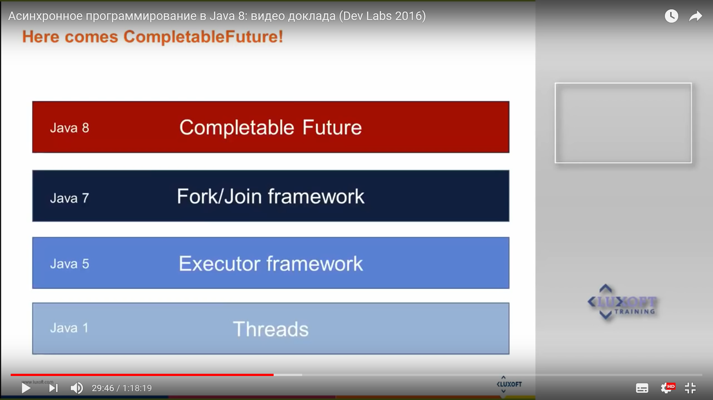

* [java 8 многопоточность](https://urvanov.ru/2016/05/27/java-8-многопоточность)

** (Completable Future: Есть ли Future у Java? (Денис Анфертьев, Jet Infosystems)) https://www.youtube.com/watch?v=8EoINS1Kacs
* (Java 8 CompletableFuture. Часть 1) https://vertex-academy.com/tutorials/ru/java-8-completablefuture << https://vertex-academy.com/tutorials/ru/java-8-uchebnik
*  (Алексей Шипилёв — ForkJoinPool в Java 8) https://www.youtube.com/watch?v=t0dGLFtRR9c >> https://shipilev.net/talks/jeeconf-May2012-forkjoin.pdf
** (Асинхронное программирование в Java 8) https://www.youtube.com/watch?v=yBF9VRiGkik
. (Дмитрий Чуйко — CompletableFuture. Хочется взять и применить) https://www.youtube.com/watch?v=hqR41XVx3kM
. (Пользовательский пул потоков в параллельном потоке Java 8) http://qaru.site/questions/27386/custom-thread-pool-in-java-8-parallel-stream (https://stackoverflow.com/questions/21163108/custom-thread-pool-in-java-8-parallel-stream)
* (Часть II. Библиотека Java) https://studfiles.net/preview/2100165/page:91/
http://levin-matveev.livejournal.com/85821.html
** (Java 8 многопоточность ** Fork/Join Framework) https://urvanov.ru/2016/05/27/java-8-многопоточность
* (Java 8) http://jug.ua/wp-content/uploads/2011/12/Java8_Ciklum.pdf


Java 1
---

* [Runable, Thread](https://github.com/Home-GWT/TopLinkExample/blob/master/src/com/voituk/jpaexample/JPAExample.java#L1075) **(** [1](http://developer.alexanderklimov.ru/android/java/thread.php) **|** [2](https://habrahabr.ru/post/164487) **)**

```text
Существует 5-способов синхронизации (`synchronized`) для критических секций между потоков:
1. относительно текущего экземпляра (объекта) класса
2. относительно статического класса

3. (lock-синхронизация) относительно одного объекта

4. оператор `volitale` (позволяет полулчить прямой доступ к данным в памяти, минуя кеш-потока)
5. использование атомарных функций (get/set) 
```

Java 5
---

* `Executors` (`newSingleThreadExecutor`, `newFixedThreadPool`, `newWorkStealingPool`) — пулы потоков


I. Исполнители

> `Callable` — это задачи которые могут быть переданы исполнителям (типа `Runnable`), но (в отличие от `Runnable`) `Callable` может возвращать значение.
                `submit()` НЕждет завершения задачи и исполнитель НЕможет вернуть результат задачи напрямую
> `Future` — поэтому (вместо `Callable`) исполнитель возвращает специальный объект-Future у которого можно запросить результат задачи.
             (`isDone`/`get`) и еще (`invokeAll`/`invokeAny`)

> `ExecutorService` — (интерфейс) сервис-исполнителей (типа `Thread` но есть важное отличие: он никогда НЕостановится, поэтому его останавливать явно)
                       (`submit`/`shutdown`/`shutdownNow`/`awaitTermination`)
> `Executors` — это (класс) предоставляет фабричные методы для создания сервисов-исполнителей
```javascript
Executors.newSingleThreadExecutor(); // вернет исполнителя с пулом в 1-поток
Executors.newFixedThreadPool(10);    // вернет исполнителя с пулом в 10-потоков
Executors.newWorkStealingPool();     // вернет исполнителя с пулом потоков равным количеству ядер машины
```

II. Синхронизация и Блокировки

> `Semaphore` — (более удобен чем `wait`/`notify`) ограничивает количество потоков которые используют `критические секции` (`tryAcquire`/`release`).

> `ReentrantLock` — (типа `wait`/`notify`) реализует то же поведение что и обычные блокировки: (`lock`/`unlock`/`tryLock`).
> `ReadWriteLock` — отдельная блокировка для чтения и для записи (`readLock`/`writeLock`/`readUnlock`/`writeUnlock`).
> `StampedLock` — (похож на `ReadWriteLock`) у этого класса есть методы для `оптимистичной блокировки` (`tryOptimisticRead`/`tryConvertToWriteLock`/`validate`).
```text
Блокировка на чтения запрещает использовать блокировку на запись.

'Оптимистическая блокировка' позволяет другим потокам блокировать ресурс НЕдожидаясь окончания работы.
(После захвата ресурса оптимистическая блокировка является валидной И предыдущая оптимистическая блокировка отправляется спать - уже перестает быть валидной)
ПРОБЛЕМА В ТОМ ЧТО ПОСТОЯНО НУЖНО СЛЕДИТЬ ЗА ВАЛИДНОСТЬЮ ОПТИМИСТИЧЕСКИХ БЛОКИРОВОК.
```

III. Атомарные операции

> `AtomicInteger`, `AtomicBoolean`, `AtomicLong`, `AtomicReference` — (`get`/`incrementAndGet`/`updateAndGet`).

> `LongAdder` — (альтернатива `AtomicLong`)
> `LongAccumulator` — (расширяет `LongAdder`)


Java 7
---

* [ForkJoinPool](jeeconf-May2012-forkjoin.pdf) **(** `ForkJoinPool.commonPool` **)**

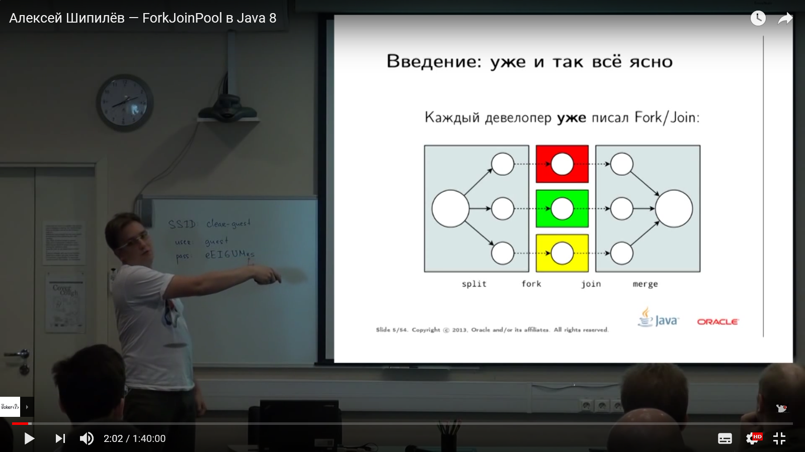

    ForkJoinPool — выполняет балансировку задач, по умолчанию (свободные потоки крадут задачи у перегруженных потоков)
    
    Подход ForkJoinPool — work stealing:
    С головой очереди может работать только владелец (стек LIFO).
    А из хвоста могут красть задачи другие потоки + и владелец (стек FIFO).


    T = N / (L * CPU)
    N — размер задачи
    L — (load factor) количество задач на поток
    CPU — количество доступных ядер процессора

- `java.util.concurrent.ForkJoinPool` — расширяет интерфейс `ExecutorService` (который наследуется от `Executor`) и может принимать параметры типа `Runable`, `Callable` и `ForkJoinTask`

* Чтобы сбалансировать нагрузку на процессоры `ForkJoinPool` может:
  - делить большую задачу на более мелкие подзадачи
  - будить свободные потоки для более мелких подзадач
* В случае использование нескольких *ForkJoinPool*:
  - (они могут сабмитить друг-друга) возможен DEADLOCK
  - ухудшают балансирования задач между пулами
  - плохо сдуваются обратно

- `commonPool()` — статический метод который возвращает системный экземпляр пула
- `submit(Callable<T>)` — этот метод создает отдельную очередь для внешних задач И возвращает `Future`
- `invoke(ForkJoinTask<T>)` — метод который выполняет всю работу и возвращает результат
- `invokeAll(Collection<? extends Callable<T>>)` — метод который выполняет всю работу и возвращает `List<Future>`


    ForkJoinTask<V> — это задача которая выполняется внутри ForkJoinPool

- `java.util.concurrent.RecursiveAction` — (нследник `ForkJoinTask<V>`) выполняет рекурсивное действие (чтобы делить большую задачу на более мелкие подзадачи)
- `java.util.concurrent.RecursiveTask<V>` — (нследник `ForkJoinTask<V>`) выполняет рекурсивное действие И возвращает результат (чтобы делить большую задачу на более мелкие подзадачи)

- `fork()` — кладет задачу в очередь и потом возвращает ее (когда задача закончит выполнятся)
- `join()` — блокирует очередь, пока эта задача не закончит выполнятся 
- compute() — этот метод либо выполняет задачу напрямую либо делит большую задачу на более мелкие подзадачи
- `invokeAll()` — запускает подзадачи и ждет их завершения
- isDone() — это асинхронный метод который проверяет состояние выполнения 
- get() — это синхронный метод который возвращает результат


Java 8
---

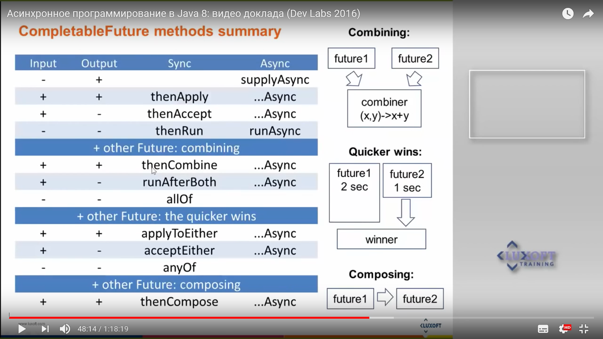

* [CompletableFuture](https://github.com/Home-SignUp/utilSlotsActualDB/blob/master/src/test/java/com/java8/thread/README.md)


`Future` и `Promise` — это примитивы для создания многопоточных приложений
Результатом любого вычисления является значение. Это значение можно поместить в некий абстрактный контейнер (такой контейнер является immutable)...

`Promise` — это функция которая помещает значение (результат вычисления кода) в контейнер.
`Future` — (это 'proxy') позволяет: следить за контейнером и когда появится какое-то значение - выполнить 'callback-функцию'; и еще трансформирует это значение внутри контейнера;
         — но НЕпозволяет получать данные из контейнера;

* методы **Future** (в Java-5): `isDone`, `get` (блокирующий)
* методы **CompletableFuture** (в Java-8):
  1. Для создания CompletableFuture можно воспользоваться методами: `new` (создать пустой); `supplyAsync` (выполнить лямбду); `runAsync` (выполнить Runnable...);
     (где *future* исполнится в `ForkJoinPool.commonPool()`, так как мы не указывали ему *Executor*. Если мы хотим указать где будет исполняться *future* то передаем `Executor` вторым параметром)
  2. Для того чтобы получить результат с CompletableFuture необходимо вызвать метод: `get`
  3. навешать callbacks-методы, которые принимают какие-то значения: `thenAccept`; `thenRun`; `exceptionally`; `handle`;
  4. Комбинирование потоками паралельных вычислений (в промежутке времени между `supplyAsync` и `get`) чтобы достич максимальной производительности:
     - трансформация: `thenApply` (добавление нескольких `callback`);
     - композиция: `thenCompose` (сценарий каких-то последовательных действий);
     - комбинирование: `thenCombine` (выполнить два действия одновременно И только после того как будет доступно оба результат выполнить функцию...);
  5. завершать: `complete` (можно поместить значение для успешного результата); `completeExceptionally` (можно завершить с помощью Exception...);
* CompletableFuture можно:
  - завершать только 1-раз
  - выполнять действия асинхронно, НО при этом он НЕисключает блокирование (в каком-то треде...)
  - контекст выполнения:
    1. если метод НЕ '..Async' - то он выполняется в том же потоке где выполнился код который завершил Future
    2. если метод '..Async' - то он выполняется: либо в каком-то пуле потоков ('ForkJoinPool.commonPool');  либо в переданном 'Executor';

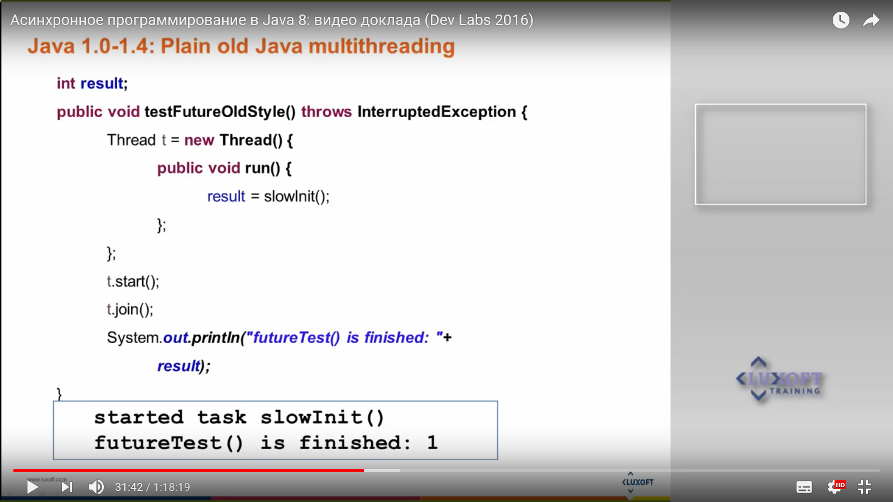
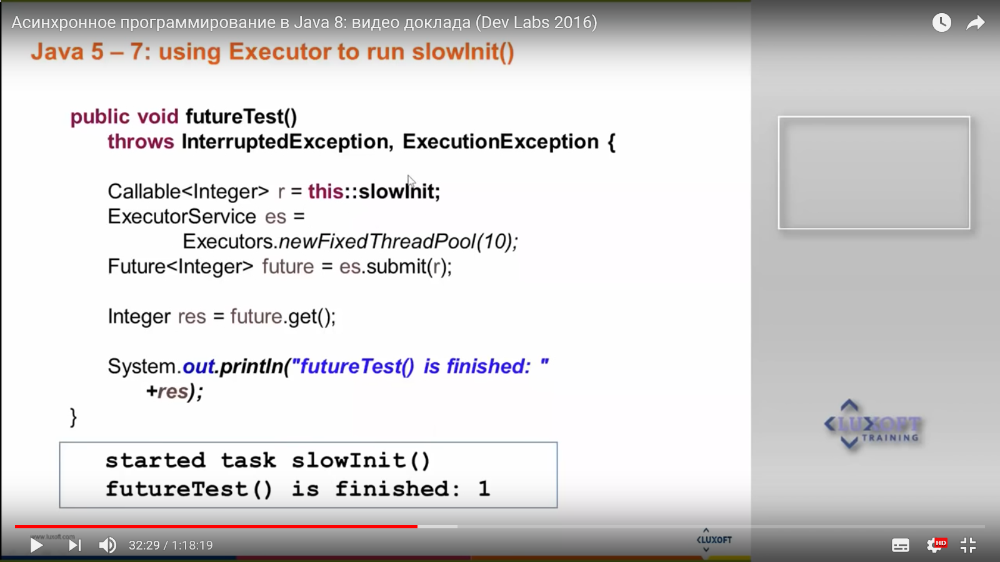
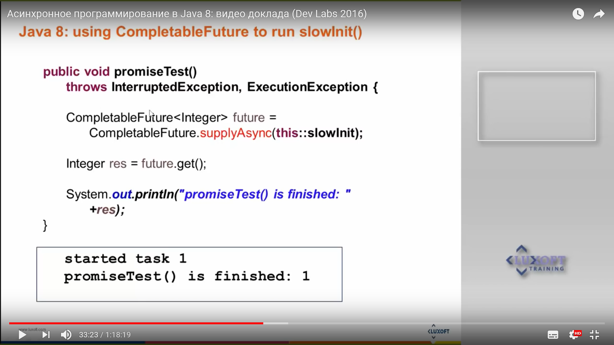
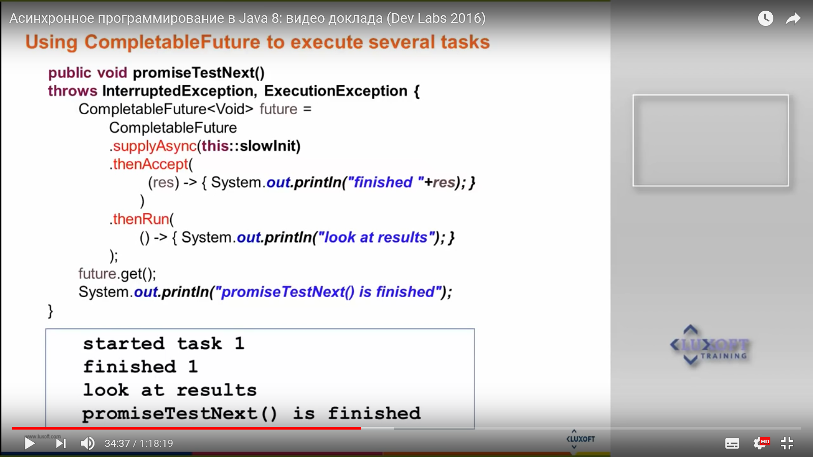
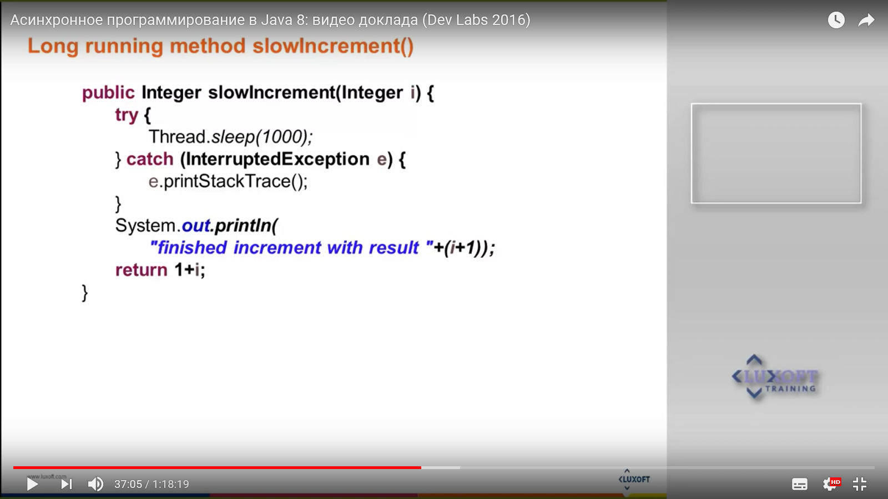
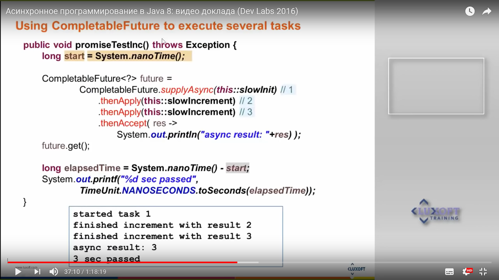
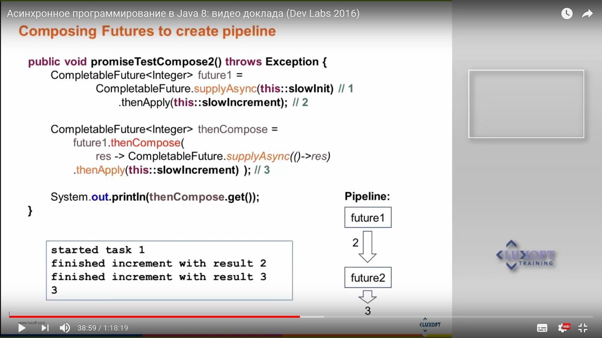

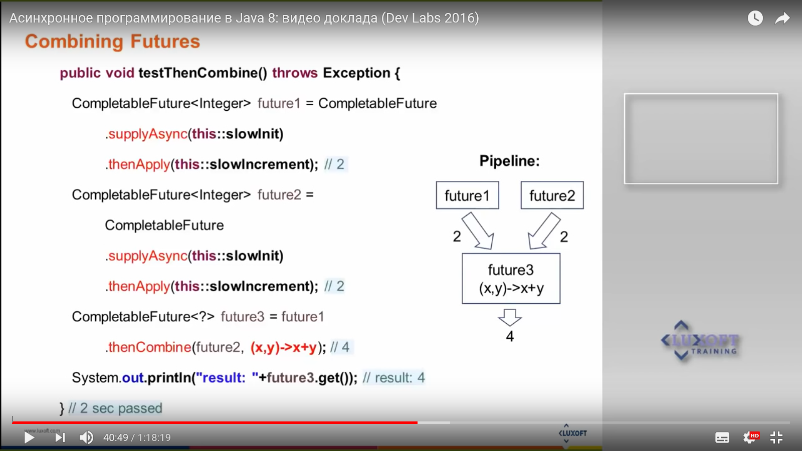
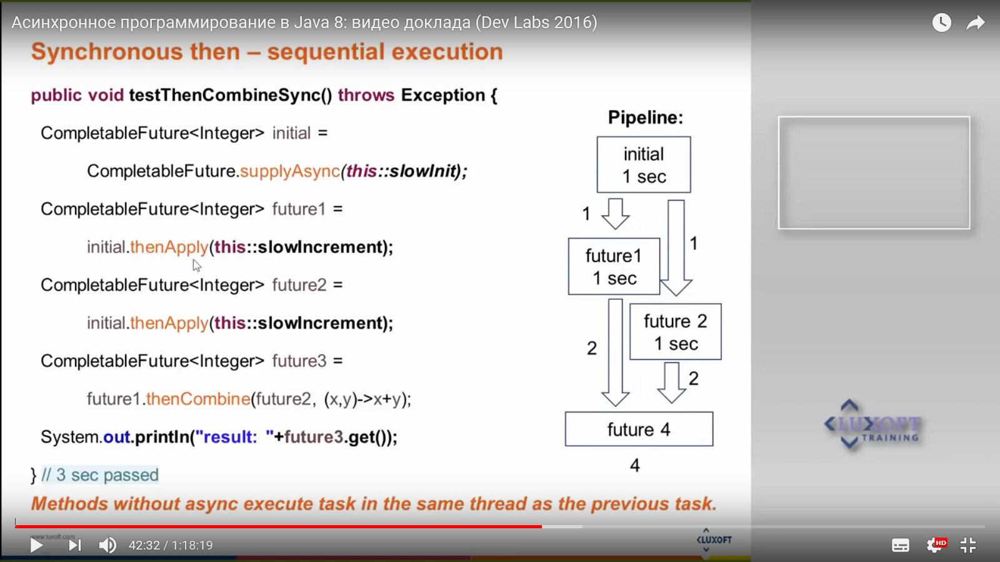
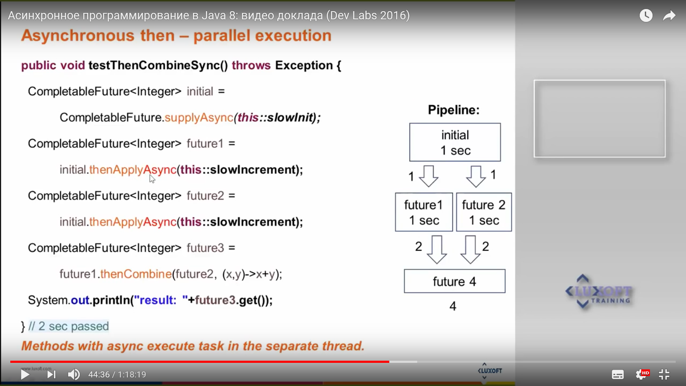
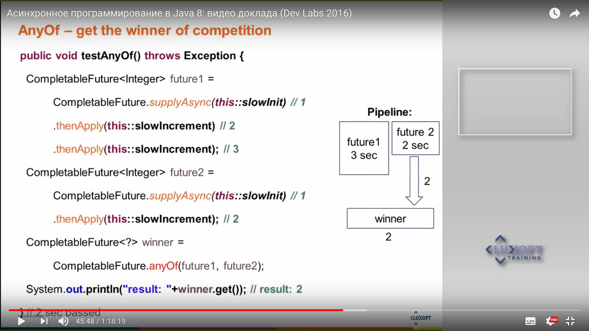
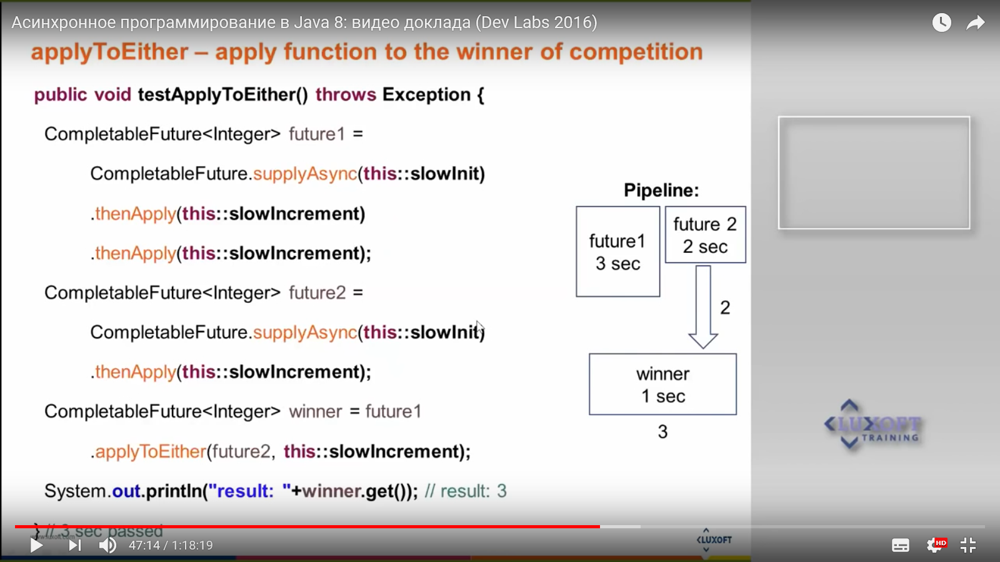
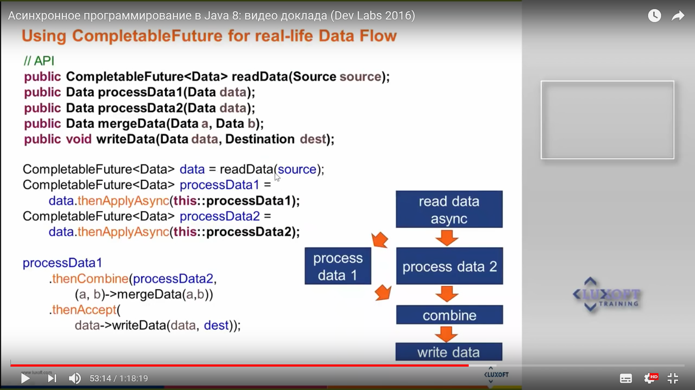


Поддержка асинхронности в технологиях Java
---

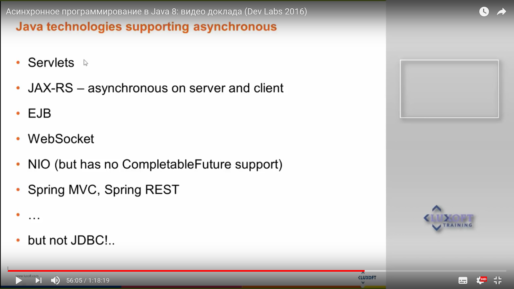

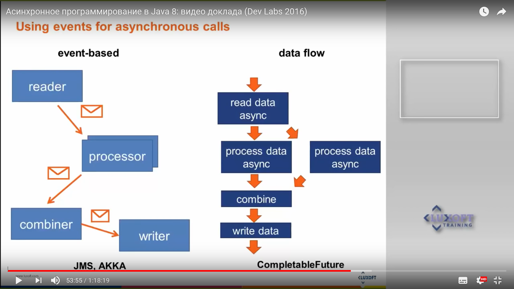
