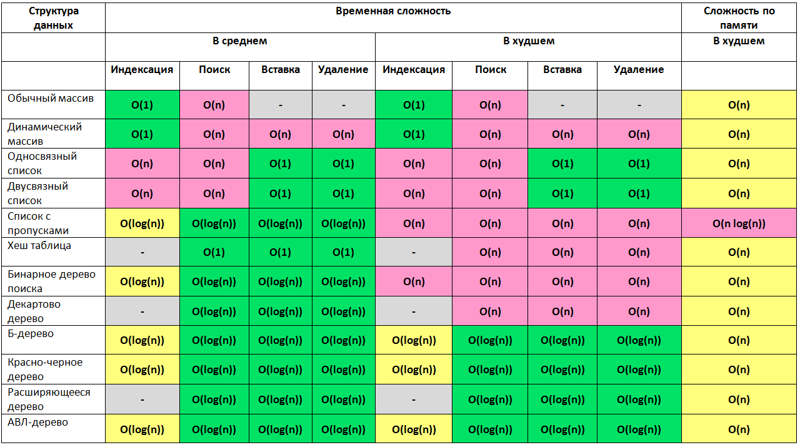

[Markdown support](https://daringfireball.net/projects/markdown/syntax)

### [Java Collections Framework 2](https://jsehelper.blogspot.com/2016/01/java-collections-framework-2.html)

```
> Степень от 0,1,2,3
  10^0 = 1
  10^1 = 10
  10^2 = 100
  10^3 = 1000
 
> Логарифм от 1,10,100,1000
  Log(1) = 0
  Log(10) = 1
  Log(100) = 2
  Log(1000) = 3
```


 


[Сложности алгоритмов `O(1), O(N), O(log(N)), O(N*log(N)), O(N*N)`](https://habrahabr.ru/post/188010)
---
[f(x) = O(g(x)) означает, что при увеличении x отношение f(x)/g(x) остается ограниченным по величине](http://forum.sources.ru/index.php?showtopic=337205)

> Определить точное время выполнения алгоритма по этой нотации нельзя, но кое-какие выводы о росте времени получить можно.
>
>* `O(1)` - затраты времени не зависят от размера задачи
>* `O(n)` - при увеличении размера задачи в 2 раза, затраты времени возрастут тоже в два раза
>* `O(n^2)` - при увеличении размера задачи в 2 раза, затраты времени возрастут примерно в четыре раза
>* `O(h/n)` - при увеличении размера задачи в 2 раза, затраты времени возрастут прямо-пропорционально емкости хеша
>* `O(log(n))` - при увеличении размера задачи вдвое, затраты времени меняются на постоянную величину

>>* `O(n*log(n))` - при увеличении задачи в два раза, затраты времени возрастут в два раза, плюс некоторая прибавка, относительный вклад которой уменьшается с ростом n. При малых n может вносить очень большой вклад. O(n*log(n)) начинает расти как квадрат при малых n, но потом рост замедляется почти до линейного
>>* `O(n^p)` - полиномиальный алгоритмы, остающиеся мечтой для некоторых задач.
>>* `O(a^n)`, `O(n!)`, `O(n^n)` - неполиномиальные алгоритмы, в порядке ускорения увеличения затрат времени


- https://www.programcreek.com/2013/09/top-10-questions-for-java-collections
- https://gist.github.com/psayre23/c30a821239f4818b0709

[Большое 'O' - производительность для общих функций некоторых коллекций](https://gist.github.com/psayre23/c30a821239f4818b0709)
---
 List                | Add  |  Get  | Contains |  Remove | Data Structure
 ------------------- | ---- | ----- | -------- | ------- | --------------
`ArrayList`          | O(1) |  O(1) | O(n)     |  O(n)  | *Array*
`LinkedList`         | O(1) |  O(n) | O(n)     |  O(1)  | *Linked List*
CopyOnWriteArrayList | O(n) |  O(1) | O(n)     |  O(n)  | *Array*

 Iterable            | Add  | Next | Remove | Data Structure
 ------------------- |------|------|--------|---------------
`Iterator`           |      | O(1) | O(n)   | *Iterator*
ListIterator         | O(1) | O(1) | O(n)   | *List Iterator*

 Map                  |   Get    | ContainsKey |   Next   | Data Structure
 -------------------- | -------- | ----------- | -------- | ------------------------
LinkedHashMap         | O(1)     |   O(1)      | O(1)     | *Hash Table + Linked List*
`EnumMap`             | O(1)     |   O(1)      | O(1)     | *Array*
`HashMap`             | O(1)     |   O(1)      | O(h / n) | *Hash Table*
`ConcurrentHashMap`   | O(1)     |   O(1)      | O(h / n) | *Hash Tables*
IdentityHashMap       | O(1)     |   O(1)      | O(h / n) | *Array*
WeakHashMap           | O(1)     |   O(1)      | O(h / n) | *Hash Table*
ConcurrentSkipListMap | O(log n) |   O(log n)  | O(1)     | *Skip List*
`TreeMap`             | O(log n) |   O(log n)  | O(log n) | *Red-black tree*

 Set                  |    Add   |  Remove  | Contains |   Next   | Size | Data Structure
 -------------------- | -------- | -------- | -------- | -------- | ---- | ------------------------
LinkedHashSet         | O(1)     | O(1)     | O(1)     | O(1)     | O(1) | *Hash Table + Linked List*
`EnumSet`             | O(1)     | O(1)     | O(1)     | O(1)     | O(1) | *Bit Vector*
`HashSet`             | O(1)     | O(1)     | O(1)     | O(h / n) | O(1) | *Hash Table*
CopyOnWriteArraySet   | O(n)     | O(n)     | O(n)     | O(1)     | O(1) | *Array*
ConcurrentSkipListSet | O(log n) | O(log n) | O(log n) | O(1)     | O(n) | *Skip List*
`TreeSet`             | O(log n) | O(log n) | O(log n) | O(log n) | O(1) | *Red-black tree*

 Queue                    |  Offer   | Peak |   Poll   | Remove | Size | Data Structure
 ------------------------ | -------- | ---- | -------- | ------ | ---- | --------------
`LinkedList`              | O(1)     | O(1) | O(1)     |  O(1)  | O(1) | *Array*
`ArrayDequeue`            | O(1)     | O(1) | O(1)     |  O(n)  | O(1) | *Linked List*
`ArrayBlockingQueue`      | O(1)     | O(1) | O(1)     |  O(n)  | O(1) | *Array*
`LinkedBlockingQueue`     | O(1)     | O(1) | O(1)     |  O(n)  | O(1) | *Linked List*
SynchronousQueue          | O(1)     | O(1) | O(1)     |  O(n)  | O(1) | *None!*
ConcurrentLinkedQueue     | O(1)     | O(1) | O(1)     |  O(n)  | O(n) | *Linked List*
DelayQueue                | O(log n) | O(1) | O(log n) |  O(n)  | O(1) | *Priority Heap*
`PriorityQueue`           | O(log n) | O(1) | O(log n) |  O(n)  | O(1) | *Priority Heap*
`PriorirityBlockingQueue` | O(log n) | O(1) | O(log n) |  O(n)  | O(1) | *Priority Heap*

##Структуры данных


##Поиск


##Сортировка


простые списки Array, Linked
Iterator
Хеш-таблицы
Самосортирующие структуры
Очередь Queue


https://stackoverflow.com/questions/559839/big-o-summary-for-java-collections-framework-implementations
https://www.programcreek.com/2013/09/top-10-questions-for-java-collections/
https://habrahabr.ru/post/237043

https://www.programcreek.com/2013/09/top-10-questions-for-java-collections
http://info.javarush.ru/translation/2014/06/26/Топ-10-вопросов-о-коллекциях-в-Java.html

