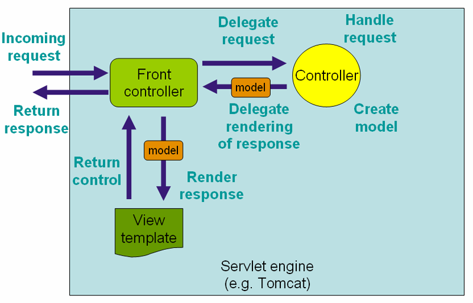

[Markdown support](https://daringfireball.net/projects/markdown/syntax)

[Хоткеи в IntelliJ-IDEA](https://juja.com.ua/java/ide/intellij-idea-hotkeys) ([+](http://eax.me/intellij-idea-hotkeys))


### [Введение в spring web mvc](https://github.com/wizardjedi/my-spring-learning/wiki/Введение-в-spring-web-mvc)
* https://github.com/wizardjedi/my-spring-learning/wiki/Введение-в-spring-web-mvc
* https://javatalks.ru/topics/14912
* https://habrahabr.ru/post/86433
* http://translatedby.com/you/introduction-to-the-spring-framework-2-5/into-ru/?page=5
* https://reversecoding.net/spring-mvc-requestparam-binding-request-parameters
* [Interceptor — перехват запросов в Spring MVC](http://www.seostella.com/ru/article/2012/04/27/interceptor-perehvat-zaprosov-v-spring-mvc.html)
* http://javastudy.ru/spring-mvc/spring-mvc-handler-mapping
* [Что такое Spring Interceptor?](http://o7planning.org/ru/11229/spring-mvc-interceptors-tutorial)


```java
/**
 * По умолчанию интерфейс HandlerMapping в Spring MVC реализуется классом RequestMappingHandlerMapping.
 * Существуют и другие реализации интерфейса, которые используют другие параметры для поиска контроллера, соответствующего запросу.
 * В Spring MVC вы можете встретить реализацию интерфейса, когда применяете аннотацию @RequestMapping:
 */
@RequestMapping(value = "/", method = RequestMethod.GET)
public ModelAndView main() {
    ModelAndView modelAndView = new ModelAndView();
    modelAndView.addObject("userJSP", new User());
    modelAndView.setViewName("index");
    return modelAndView;
}
```




```text
Spring Interceptor:
Когда вы приходите в компанию и хотите встретиться с менеджером этой компании, вам нужно пройти через перехватчики (Interceptor), здесь ими могут являться охранник, ресепшионист,...
```

```java
/**
 * Эти перехватчики (Interceptor) позволяют выполнять задачи, которые являются общими для каждого запроса или набора запросов, без необходимости копировать код в каждом методе контроллера
 * Например, можно выполнять аутентификацию пользователя прежде, чем запрос достигнет Вашего контроллера и, в случае успеха, получить некоторые дополнительные данные о пользователе из базы данных, добавив их в объект HttpServletRequest
 */
public class StatsInterceptor extends HandlerInterceptorAdapter {

	private static final Logger logger = LoggerFactory.getLogger(StatsInterceptor.class);
	
	/**
	 * Метод preHandle вызывается перед тем как Front-контроллер передает управление контроллеру
	 * (Если метод возвращает значение true, обработка передается контроллеру, ответственному за этот запрос)
     */
	@Override
	public boolean preHandle(HttpServletRequest request,
			HttpServletResponse response, Object handler) throws Exception {
		
		logger.info("Client User-Agent: " + request.getHeader("User-Agent"));
		
		return super.preHandle(request, response, handler);
	}
	
	/**
	 * Метод postHandle вызывается после того как контроллер отработал и вернул результат
     */
	@Override
	public void postHandle(HttpServletRequest request,
			HttpServletResponse response, Object handler,
			ModelAndView modelAndView) throws Exception {
		super.postHandle(request, response, handler, modelAndView);
	}

	/**
	 * Метод afterCompletion вызывается после того как ответ сформирован
     */
	@Override
	public void afterCompletion(HttpServletRequest request,
			HttpServletResponse response, Object handler, Exception ex)
			throws Exception {
		super.afterCompletion(request, response, handler, ex);
	}
}
```

```xml
<!-- Теперь нам надо зарегистрировать этот Interseptor. Делается это в контексте сервлета добавлением следующих строк: -->
<interceptors>
	<beans:bean class="com.seostella.spring.interceptor.StatsInterceptor" />

	<!-- Также есть возможность "ловить" не все запросы, а ограничиться лишь некоторыми, делается это так: -->
    <interceptor>
        <mapping path="/weather/*" />
        <beans:bean
            class="com.seostella.spring.interceptor.ExecutionTimeInterceptor" />
    </interceptor>
</interceptors>
```


Методы handleRequest..:

```java
@Controller
@RequestMapping("/")
public class MainController {
	@RequestMapping(value="user/list/id/{id}", method=RequestMethod.GET)
	@ResponseStatus(HttpStatus.OK)
	public String userList(Model ui, @PathVariable("id") Long id)
	{
		ui.addAttribute("contacts", "Ce contacts"+id.toString());
		
		return "user/list";
	}
	
	@RequestMapping(value="user/list/id/{id}", method=RequestMethod.GET, produces="text/json")
	@ResponseStatus(HttpStatus.OK)
	@ResponseBody
	public String userListJson(Model ui, @PathVariable("id") Long id)
	{
		return "{id:" + id.toString() + '}';
	}

    /**
     * User u - объект пользователя. Параметры POST-запроса будут сконвертированы в объект пользователя.
     * BindingResult br - содержит результаты конвертации параметров запроса в объект пользователя
     * Model ui - объект модели
     */
    @RequestMapping(value="user/list/form", method=RequestMethod.POST)
//    public String userListPost(@ModelAttribute("user") User u, BindingResult br,  Model ui) // явно указываем с помощью аннотации
    public String userListPost(User u, BindingResult br,  Model ui) // Spring автоматически найдет и сконвертированы в объект
    {
        System.out.println(br.toString());
        System.out.println(u.toString());
            
        ui.addAttribute("user", u);
            
        return "user/list";
    }

    @InitBinder
    protected void initBinder(WebDataBinder binder) {
        binder.registerCustomEditor(Group.class, "group", new PropertyEditorSupport() {
            @Override
            public void setAsText(String text) {
                Group g = new Group(Long.valueOf(text));
                
                setValue(g);
            }
        });
    }

    /**
     * Запрет на редактирование отдельных элементов формы
     */
    @InitBinder
    public void initBinder(WebDataBinder binder) {
        binder.setAllowedFields(new String[]{"field*", "subfield1"});
    }
}
```

```java
@RequestMapping(value = "/", method = RequestMethod.GET)
@ResponseBody
public ResponseEntity<MyClass> get(){
    // ...
    retutn new ResponseEntity<>(myClass, HttpStatus.OK);
}
```

* `@RequestMapping(value="user/list/id/{id}", method=RequestMethod.GET, produces="text/json")` — реализация интерфейса HandlerMapping в Spring MVC реализуется классом RequestMappingHandlerMapping
* `@RequestParam("name")` — String namе говорит о том, что в обработчик получает поле name формы которую обрабатывает
* `@PathVariable("id")` — Long id указывает, что в метод необходимо передать параметр id типа Long, который необходимо взять из пути (шаблон URL и расположение параметра id уже описание в @RequestMapping(value="user/list/id/{id}"...)

* `Model`, `ModelAndView`, `@ModelAttribute` — это данные которые контроллер передает на JSP-страницу 'view' (предварительно данные добавляются в эту модель с помощью '.addAttribute(..)') и в результате контроллер возвращает название JSP-страницы (String)
                                                ('Model' — передается как параметр в веб-метод, а 'ModelAndView' — создается внутри теля веб-метода)
                                                (в этом случае веб-метод возвращает набор параметров-аттрибутов)
* `@ResponseBody` — означает, что результатом работы метода (возвращаемым значением) является тело ответа
                     (в этом случае веб-метод возвращает json...)
* `@ResponseEntity<..>` — конвертирует данные из структуры класса в json
                           (в этом случае веб-метод возвращает класс-объект как json...)
* `BindingResult` — содержит результаты конвертации параметров запроса в объект
* `@InitBinder` — указывает, что данный метод проводить настройку биндинга и преобразования
                   (WebDataBinder binder - собственно объект биндера, регистрируем специфичный преобразователь в объект класса...с использованием расширения класса PropertyEditorSupport)

* `@ResponseStatus(HttpStatus.OK)` — будет возвращаться HTTP-статус 200 OK


Обработка исключений
---
Вызов данных обработчиков осуществляется в следующих случаях:
* `error500` — произошла исключение и оно не перехвачено
* `error403` — подключён Spring Security и сгенерировано исключение `AccessDeniedException`, которое не было перехвачено

```java
/**
 * Например, реализуем исключения ResourceNotFoundException с отображением соответствующей страницы
 * Объявим исключение и добавим аннотацию, соответствующую коду 404:
 */
@ResponseStatus(value=HttpStatus.NOT_FOUND)
public class NotFoundException extends RuntimeException {
	public NotFoundException(String message){
		super(message);
	}
}

/**
 * В методе контроллера добавим некоторую проверку и генерацию исключения:
 */
@RequestMapping(value="/some-page", method=RequestMethod.GET)
public String somePage(Model ui)
{
	if (!this.getResource()) {
		throw new NotFoundException("Not found");
	} else {
		// ...
		return "resources/view";
	}
}
```

```xml
<!-- Теперь в дескрипторе развёртываня web.xml добавим описание ошибки 404 -->
<error-page>
	<error-code>404</error-code>
	<location>/WEB-INF/views/error404.jsp</location>
</error-page>
```

и файл со страницей 404:
`/WEB-INF/views/errorPages/error404.jsp`


