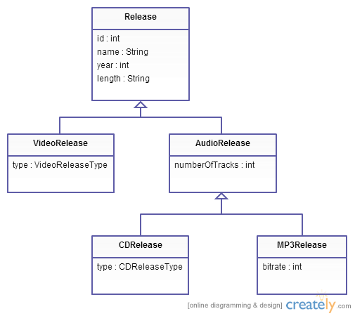
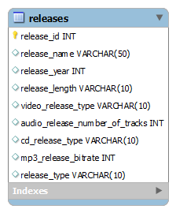
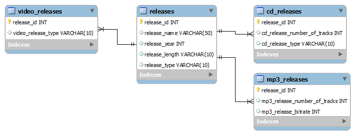
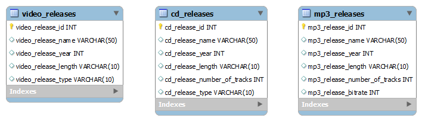

[Markdown support](https://daringfireball.net/projects/markdown/syntax)

[Хоткеи в IntelliJ-IDEA](https://juja.com.ua/java/ide/intellij-idea-hotkeys) ([+](http://eax.me/intellij-idea-hotkeys))


### [Оператор SQL HAVING](http://2sql.ru/novosti/sql-having)
* [Оператор SQL HAVING](http://2sql.ru/novosti/sql-having)
* http://www.firststeps.ru/sql/oracle/r.php?36
* https://technet.microsoft.com/ru-ru/library/ms184262(v=sql.105).aspx
* http://www.sql-tutorial.ru/ru/book_having_clause.html
* [Оператор SQL LIMIT](http://2sql.ru/novosti/sql-limit)
* http://theory.phphtml.net/sql/having.html

Оператор SQL HAVING является указателем на результат выполнения агрегатных функций.

Агрегатной функцией в языке SQL называется функция, возвращающая какое-либо одно значение по набору значений столбца.
Такими функциями являются: `COUNT()`, `MIN()`, `MAX()`, `AVG()`, `SUM()`
`HAVING aggregate_function(column_name) operator value`

```
Ниже приведен порядок обработки предложений в операторе SELECT:
    FROM
    WHERE
    GROUP BY
    HAVING
    SELECT
    ORDER BY 
```

Имеется следующая таблица Artists:

Singer         | Album                           | Year | Sale
---------------|---------------------------------|------|--------
The Prodigy    | Invaders Must Die               | 2008 | 1200000
Drowning Pool  | Sinner                          | 2001 | 400000
Massive Attack | Mezzanine                       | 1998 | 2300000
The Prodigy    | Fat of the Land                 | 1997 | 600000
The Prodigy    | Music For The Jilted Generation | 1994 | 1500000
Massive Attack | 100th Window                    | 2003 | 1200000
Drowning Pool | Full Circle                      | 2007 | 800000
Massive Attack | Danny The Dog                   | 2004 | 1900000
Drowning Pool | Resilience                       | 2013 | 500000


Пример 1. Используя оператор SQL HAVING вывести название исполнителей (Singer) число продаж альбомов (Sale) которого больше 2000000:

```sql
select Singer, SUM(Sale)
FROM Artist
GROUP BY Singer
HAVING SUM(Sale) > 2000000;
```

Результат:

Singer         | Sum(Sale)
---------------|---------
Massive Attack | 54000000
The Prodigy    | 33000000


Пример 2. Используя оператор SQL HAVING вывести название исполнителя, который исполнялся еще до 1995 года:

```sql
SELECT Singer, MIN(Year)
FROM Artist
GROUP BY Singer
HAVING MIN(Year) < 1995;
```

Результат:

Singer      | MIN(Year)
------------|---------
The Prodigy | 1994


Для каждого офиса, в котором работают 2-а и более человек, вычислить общий плановый и фактический объем продаж для всех служащих офиса. 

```sql
SELECT city, SUM(quota), SUM(salesreps.sales)
FROM offices, salesreps
WHERE offices = rep_office
GROUP BY city
HAVING COUNT(*) >= 2;
```

CITY                           SUM(QUOTA) SUM(SALESREPS.SALES)
------------------------------ ---------- --------------------
Контрогайка                           700              835,915
Красный Мотоцикл                      575              692,637
Чугуевск                             1175             1121,084

```
Здесь хорошо видно, что присутствуют оба выражения и WHERE и HAVING, каждый выполняет свою функцию в запросе:
1. Объединяются таблицы OFFICES и SALESREPS для того, чтобы найти город, в котором работает служащий.
2. Группируются строки объединенной таблицы по офисам.
3. Исключаются группы, содержащие две или менее строки - это те строки, которые не удовлетворяют критерию предложения HAVING.
4. Вычисляются общие плановые и фактические объемы продаж для каждой группы. 
```


Показать цену, количество на складе и общее количество заказанных единиц для каждого наименования товара, если для него общее количество заказанных единиц превышает 75 процентов от количества товара на складе.

```sql
SELECT DESCRIPTION, PRICE, QTY_ON_HAND, SUM(QTY)
FROM PRODUCTS, ORDERS
WHERE MFR = MFR_ID
GROUP BY MFR_ID, PRODUCT_ID, DESCRIPTION, PRICE, QTY_ON_HAND
HAVING SUM(QTY) > (0.75 * QTY_ON_HAND)
ORDER BY QTY_ON_HAND DESC;
```

DESCRIPTION             PRICE    QTY_ON_HAND   SUM(QTY)
------------------ ---------- -------------- ----------
Лампа настольная           55            277        223
Рейка деревянная          107            207        223
Носки черные               76            167        223
Рейка пластмассовая       117            139        223
Труба алюминиевая         355             38         32
Карандаш простой           25             37        223
Подушка ватная            177             37         32
Нож специальный           475             32         30
Монитор LG               2500             28        223
Наушники SONY             975             28         30
Коробка картонная        2,75             25        223
Рубероид рулоны           250             24         30
Электродвигатель          243             15         26
Бочка пластмассовая       350             14         60
Доска профильная         4500             12         60
Телевизор SAMSUNG        4500             12         60
Профиль специальный      1875              9         30
Осветитель ртутный       1425              5         30
Тарелка фарфоровая        180              0          2

19 rows selected


Cat(name, ago, owner_id);
Owner(id);
ManyToOne

```sql
SELECT owner_id, MAX(name)
FROM Cat, Owner
GROUP BY owner_id;
```


[Для проведения тестирования, в Oracle 11g](https://habrahabr.ru/post/181033) **(** [+](http://bestwebit.biz.ua/sql_exersize/sql_task_group_by_01.html) **)**
---

```sql
-- DEPARTMENT

ID  | NAME
```

```sql
-- EMPLOYEE

ID  | DEPARTMENT_ID  | CHIEF_ID  | NAME  | SALARY
```

1. Вывести список сотрудников, получающих заработную плату большую чем у непосредственного руководителя:
```sql
-- `FROM` загружает данные в рабочую память sql (КЕШ), таким способом можно создать две разных области в рабочей памяти sql для одной и той-же таблицы
-- одна и та же запись может описывать человека и как обычного сотрудника и как шефа, таким способом можно сказать что у сотрудника есть конкретный шеф
SELECT e.*
FROM employee e, employee boss
WHERE e.CHIEF_ID = boss.ID AND boss.SALARY < e.SALARY;
```

2. Вывести список сотрудников, получающих максимальную заработную плату в своем отделе:
```sql
-- подзапрос выполняет выборку (список) всех сотрудников для текущего департамента из основного запроса, далее агрегаторная функция `MAX` - возвращает только одно значение - а именно найденную максимальную зарплату
-- (поскольку `LIMIT` для агрегаторных функций не работает) а дальше по этому значению (максимальной зарплате) основной запрос делает выборку сотрудников для этого отдела
SELECT a.*
FROM employee a
WHERE a.SALARY =
    (SELECT MAX(SALARY)
     FROM employee b
     WHERE b.DEPARTMENT_ID = a.DEPARTMENT_ID);
```
или
```sql
SELECT NAME 
FROM employee e  
JOIN 
  (SELECT DEPARTMENT_ID, MAX(SALARY) AS max_salary 
   FROM employee
   GROUP BY DEPARTMENT_ID) d
  ON e.DEPARTMENT_ID = d.DEPARTMENT_ID
where e.SALARY = d.max_salary
```

3. Вывести список ID отделов, количество сотрудников в которых не превышает 3-х человек:
```sql
-- группируем (`GROUP BY`) все записи по отделам
-- с помощью агрегаторной функции подсчитываем количество записей для каждой группы, и добаляем условие поиска... 
SELECT DEPARTMENT_ID
FROM employee
GROUP BY DEPARTMENT_ID
HAVING COUNT(*) <= 3;
```

4. Вывести список сотрудников, не имеющих назначенного руководителя, работающего в том-же отделе:
```sql
-- загружаем и создаем две разные области в рабочей памяти sql
-- по условию и бос и сотрудник должны быть из одного департамента
-- (`JOIN` - позволяет выделить все пересекающиеся записи из этих двух таблиц) по условию мы ищем всех боссов которые поза областью пересечения... 
SELECT e.*
FROM employee e LEFT JOIN employee boss
ON (e.CHIEF_ID = boss.ID AND e.DEPARTMENT_ID = boss.DEPARTMENT_ID)
WHERE boss.ID IS NULL;
```

5. Найти список ID отделов с максимальной суммарной зарплатой сотрудников:
```sql
-- можно создать процедуру которая будет возвращать таблицу из двух полей (`WITH sum_salary AS`)... а внутри сгрупируем поля по `DEPARTMENT_ID` и вернем сумму (SALARY) для каждого департамента
-- (поскольку `LIMIT` для агрегаторных функций не работает) в подзапросе можно вернуть максимальное значение `SALARY`, которое будет только одно, дальше по этому значение делаем выборку и возвращаем все записи которые имеют такую максимальную сумму
-- (а в качестве альтернативной таблицы можно использовать процедуру...)
WITH sum_salary AS
    (SELECT DEPARTMENT_ID, SUM(SALARY) AS salary
     FROM employee
     GROUP BY DEPARTMENT_ID);

SELECT DEPARTMENT_ID
FROM sum_salary a
WHERE a.salary = 
    (SELECT MAX(salary)
     FROM sum_salary);
```
или
```sql
-- последний подзапрос вернет таблицу, которая будет группировать и подсчитывать общую сумму `SALARY` для каждого департамента
-- первый подзапрос вернет только одно - максимальное значение суммы `SALARY`
-- основной запрос сгрупирует все записи по департаменту и получит сумму `SALARY` по каждому департаменту
-- а дальше по условию если общая сумма текущего департамента равняется максимальной сумме, тогда возвращаем это...
SELECT DEPARTMENT_ID 
FROM employee 
GROUP BY DEPARTMENT_ID 
HAVING SUM(SALARY) = 
  (SELECT MAX(sum_salary) 
   FROM
    (SELECT DEPARTMENT_ID, SUM(SALARY) AS sum_salary 
     FROM employee 
     GROUP BY DEPARTMENT_ID)
  )
```


(Alex Tretyakov Blog ** JPA-маппинг иерархии классов с помощью Table-per-concrete-class стратегии) http://alextretyakov.blogspot.com/2014/04/jpa-table-per-concrete-class-strategija.html


[JPA-маппинг и стратегии](https://github.com/Home-GWT/TopLinkExample/blob/master/src/com/voituk/jpaexample/JPAExample.java#L468)
---

Существует 3-и стратегии маппинга иерархий наследования:
* [Single-table](http://alextretyakov.blogspot.com/2013/11/jpa-mapping-ierarhii-klassov-s-pomoshju.html) — данные всех типов должны храниться в одной таблице;
  

* [Joined](http://alextretyakov.blogspot.com/2013/11/jpa-joined-strategija.html) — Данные общие для всех типов должны храниться в одной таблице; Данные конкретных типов должны храниться в соответвующих таблицах; И эти таблицы конкретных типов должны быть связаны с таблицей общих данных с помощью внешних ключей;
  
 
* [Table-per-concrete-class](http://alextretyakov.blogspot.com/2014/04/jpa-table-per-concrete-class-strategija.html) — все данные каждого типа релиза должны храниться в отдельной таблице;
  


Все эти стратегии имеют преимущества и недостатки.
1. В случае когда данные хранятся только в одной таблице:
   — будут простые sql-запросы для выборки данным;
   — но для выполнения поиска данных теряется много времени;
2. В случае когда данные хранятся в разных таблицах:   
   — поиск данных выполняется за максимально быстрое время;
   — но построения sql-запросов сильно усложняется И тем самым теряется время на обработку sql-запросов построения...; 
3. В случае когда специальные данные хранятся в связанных таблицах:
   — общие характеристики по производительности и сложности sql-запросов будут оптимальными...;


Классы / под-классы 
(можно провести аналогию с солдатом и воено-начальниками...)
(или можно провести аналогию с разными типами орудий...)

Все подобные данные можно хранить в базе данных только в одной таблице!
Такой способ является гибридным (между `1` и `3`):
таблица будет одна, но при этом хранится внутреняя ссылка на другие записи внутри этой таблицы...

Такое поведение будет справедливо только для схожих классоа и подклассов!
(Для разных типов классов необходимы разные таблицы...)


